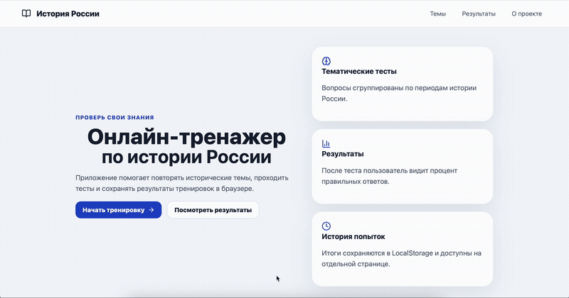

[](https://qlty.sh/gh/1ce1ceice/projects/RussianHistoryTrainer)

# Онлайн-тренажер по истории России

Приложение для подготовки и самопроверки по истории России.

## :question:Функции

- каталог тем
- прохождение теста по выбранной теме
- выбор ответа и переход между вопросами
- подсчет процента правильных ответов
- просмотр объяснений после завершения теста
- сохранение истории прохождений в LocalStorage
- очистка истории результатов
- адаптивная верстка

## Архитектура

- **Frontend:** React + Vite

- **Routing:** React Router

- **State:** React Hooks

- **Storage:** LocalStorage

- **Data:** JavaScript-массивы с вопросами

- **UI:** CSS

- **Deployment:** Netlify

## :exclamation:Установка

1. Клонировать репозиторий

```bash
git clone git@github.com:1ce1ceice/RussianHistoryTrainer.git
cd RussianHistoryTrainer
```

2. Установить зависимости
```bash
npm install
```

## Запуск
```bash
npm run dev
```
Приложение будет доступно по адресу:
http://localhost:5173

## Деплой

https://russianhistorytrainer.netlify.app

## Demo




